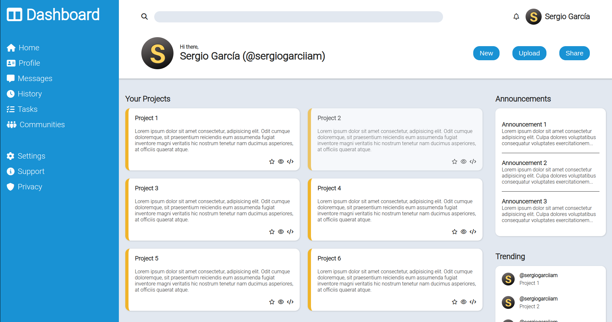

# Admin Dashboard

An admin dashboard created with html and css with the goal of learning "grid layout"

## Screenshot

## Acknowledgements

- Project idea and design by [The Odin Project](https://www.theodinproject.com/lessons/node-path-intermediate-html-and-css-sign-up-form)
- Icons from [Font Awesome](https://fontawesome.com/icons)

## Author

[Sergio García](https://github.com/sergiogarciiam)

## License

This project is open source and available under the [MIT License](./LICENSE).
